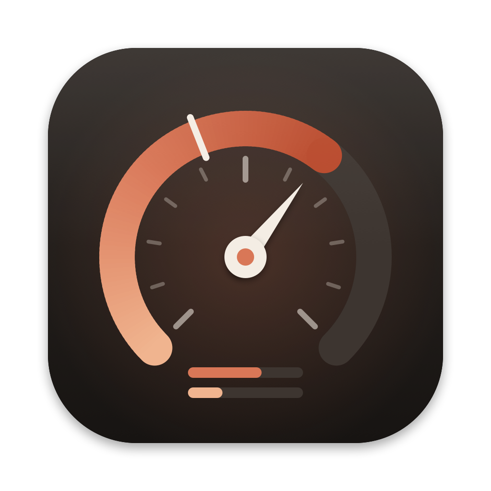

<p align="center"></p>

# ClaudeMeter

A macOS desktop widget and menu bar app that shows how much of your Claude plan you have used: the 5-hour session limit, the weekly limit, and any per-model weekly limits, with live countdowns to each reset.

It reads the same numbers Claude Code's `/usage` command shows.

## Features

- **Desktop widget** (small and medium) with usage bars, a session ring, and reset countdowns
- **Menu bar item** showing `session% · weekly%`, with a detail panel listing every limit and its exact reset time
- **Pace marker**: the thin tick on each bar shows how much of the window's time has passed. If the fill is past the tick, you are using the allowance faster than an even pace.
- Colors shift from clay to orange to red at 60% and 85%
- Widget drops a window to 0% at its reset time, even between fetches
- Last good numbers stay visible (with a warning badge) if a fetch fails
- Menu bar icon can be hidden; the widget keeps updating
- Optional open at login

## Requirements

- macOS 14 or later
- [Claude Code](https://claude.com/claude-code), signed in with a Claude subscription (Pro or Max). API key logins have no plan usage to show.

## Install

Download `ClaudeMeter.zip` from the [latest release](../../releases/latest), unzip it, and move `ClaudeMeter.app` to `/Applications`. Open it, then add the widget: right-click the desktop, choose **Edit Widgets**, and search for **Claude Usage**.

Release builds are signed with a Developer ID certificate and notarized by Apple, so they open without Gatekeeper warnings.

### Build from source

Requires Xcode and [XcodeGen](https://github.com/yonaskolb/XcodeGen) (`brew install xcodegen`).

```bash
./scripts/build.sh            # builds build/ClaudeMeter.app
./scripts/build.sh --install  # also copies to /Applications and launches it
```

For a notarized release build (Developer ID certificate and a `notarytool` keychain profile required; setup steps are at the top of the script):

```bash
./scripts/release.sh          # archive, Developer ID export, notarize, staple -> build/release/ClaudeMeter.zip
```

The Xcode project is generated from `project.yml`. To build under your own Apple developer account, change `DEVELOPMENT_TEAM` in `project.yml` and the team prefix in `SnapshotStore.groupID` (`Shared/UsageSnapshot.swift`) so the app group matches your team.

## Authentication

ClaudeMeter has no login of its own. It borrows the login Claude Code already has on this Mac, so it always tracks **the account Claude Code is signed into**. To track a different account, run `/login` in Claude Code; ClaudeMeter follows on its next fetch.

How it works, step by step:

1. When you sign in to Claude Code with a Claude plan, Claude Code stores an OAuth token in your login Keychain under the item **`Claude Code-credentials`**.
2. On each fetch, ClaudeMeter reads that item with macOS's built-in `/usr/bin/security` tool (`security find-generic-password -s "Claude Code-credentials" -w`). If the Keychain item is missing, it falls back to `~/.claude/.credentials.json`, which some setups use instead.
3. It sends the access token as a bearer token to `https://api.anthropic.com/api/oauth/usage` (with the `anthropic-beta: oauth-2025-04-20` header). The response contains utilization and reset time for each rate limit window. The plan name shown in the widget comes from the `subscriptionType` field in the stored credentials.

What it does **not** do:

- **It never stores the token.** Only the percentages and reset times are written to the shared app group file the widget reads. The widget extension is sandboxed and never sees the token.
- **It never refreshes the token.** Claude Code refreshes its own token whenever you use it. If the token expires because Claude Code has not run in a while, ClaudeMeter shows *"Login token expired. Run any `claude` command to refresh it."* and keeps the last numbers until Claude Code renews it. This is deliberate: two programs refreshing the same OAuth login can rotate each other's refresh token and sign one of them out.
- **It never sends the token anywhere except `api.anthropic.com`.** There is no analytics or other network traffic.

Keychain access: the token is readable by programs running as your user through `security`, and ClaudeMeter uses that same access. If macOS asks whether ClaudeMeter or `security` may use "Claude Code-credentials", that prompt is this read; choose **Always Allow** so it does not ask on every fetch.

> The `/api/oauth/usage` endpoint is not officially documented by Anthropic. It is what Claude Code uses for `/usage`, and it could change without notice. The parser is lenient: any top-level object with a numeric `utilization` becomes a window, so new limit types appear automatically.

## Refresh cadence

- The app fetches on launch and every 5 minutes (`pollInterval` in `App/UsageService.swift`). The refresh button in the menu panel fetches immediately.
- After each fetch the app asks WidgetKit to reload the widget. macOS rate limits widget redraws, so the widget can occasionally lag the menu bar by a few minutes. Reset countdowns tick live regardless.
- The widget shows a warning badge if the last fetch failed or the data is more than 30 minutes old.

## Hiding the menu bar icon

Click **Hide menu bar icon** in the menu panel. The app keeps running and the widget keeps updating. To bring the icon back, open ClaudeMeter again (Spotlight or Finder) or click the widget.

## Project layout

| Path | Purpose |
| --- | --- |
| `App/` | Menu bar app: credential read, polling, menu UI |
| `Widget/` | WidgetKit extension (sandboxed, read only) |
| `Shared/` | Snapshot model, app group store, shared bar and ring views |
| `Icon/render.swift` | Draws the app icon with Core Graphics; regenerate with `swift Icon/render.swift --appiconset App/Assets.xcassets/AppIcon.appiconset` |
| `scripts/build.sh` | Generate project, build, optionally install |

## Disclaimer

ClaudeMeter is an independent project and is not affiliated with or endorsed by Anthropic.
